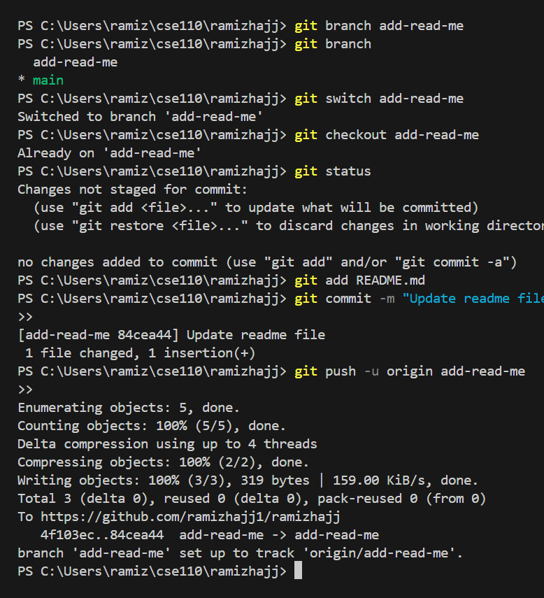
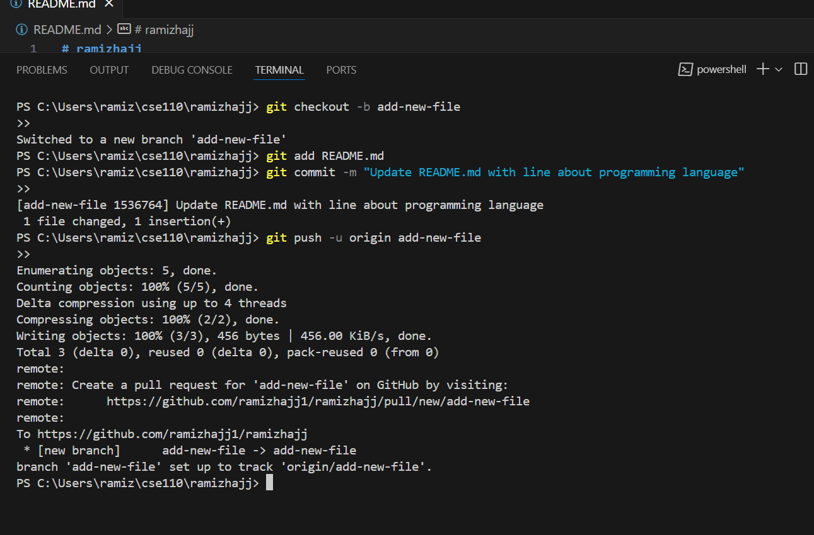
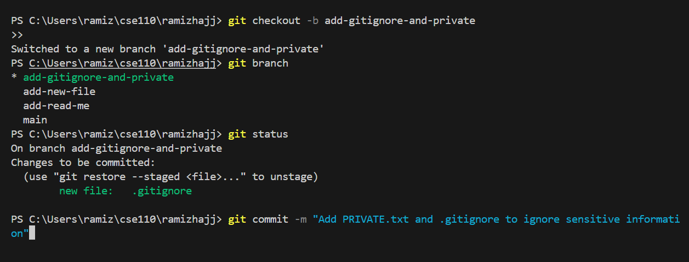

# Screenshots

## Screenshot 1

Description: Using git from command line and running all commands.

## Screenshot 2

Description: Creating .gitignore and PRIVATE.md.

## Screenshot 3

Description: Same on VSCode.
